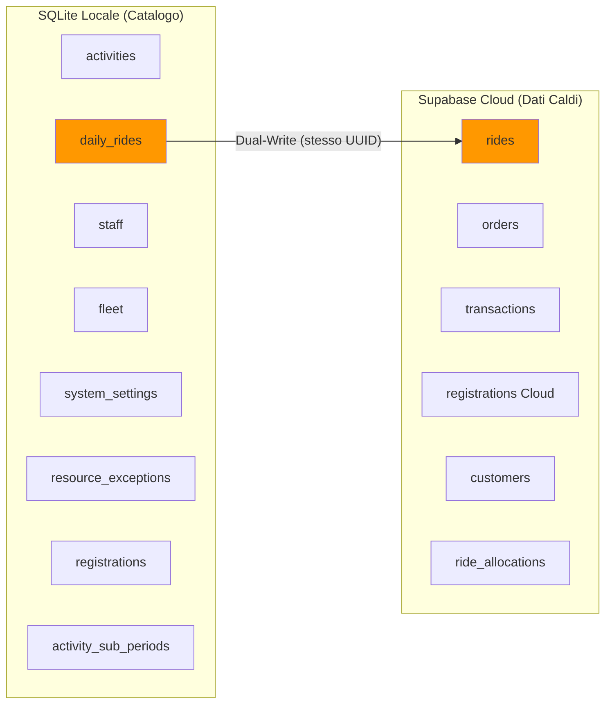

# SYSTEM SNAPSHOT REPORT — RAFTING REPUBLIC GESTIONALE

**Data:** 27/02/2026 20:22 CET
**Target:** Onboarding Tech Lead
**Versione Backend:** 0.3.0 (FastAPI)
**Fase Corrente:** 7 — Crew Builder (Lavagna d'Imbarco Digitale)

---

## INDICE

1. [Visione d'Insieme](#1-visione-dinsieme)
2. [Stack Tecnologico](#2-stack-tecnologico)
3. [Architettura Ibrida Dual-Database](#3-architettura-ibrida-dual-database)
4. [Schema Database Completo](#4-schema-database-completo)
5. [Mappa API Endpoints](#5-mappa-api-endpoints)
6. [Mappa File System](#6-mappa-file-system)
7. [Motore Predittivo (Availability Engine)](#7-motore-predittivo)
8. [Frontend Architecture](#8-frontend-architecture)
9. [Pinia Stores](#9-pinia-stores)
10. [Flussi Dati Critici](#10-flussi-dati-critici)
11. [Moduli Operativi](#11-moduli-operativi)
12. [Bug Pendenti](#12-bug-pendenti)
13. [Debito Tecnico](#13-debito-tecnico)
14. [Storico Fasi Completate](#14-storico-fasi-completate)
15. [Deploy e Infrastruttura](#15-deploy-e-infrastruttura)
16. [Dogmi Architetturali](#16-dogmi-architetturali)

---

## 1. VISIONE D'INSIEME

Rafting Republic Gestionale è un sistema gestionale operativo costruito per una società di rafting. Copre l'intero ciclo operativo giornaliero:

- **Segreteria (POS):** Prenotazioni, pagamenti, CRM silente
- **Logistica:** Allocazione guide/gommoni/furgoni, semaforo disponibilità, Crew Builder
- **Check-in Digitale:** Kiosk pubblico via Magic Link, firma grafometrica, manleva PDF
- **AI Vision:** OCR documenti identità (Azure Cognitive Services, solo cloud)
- **Yield Management:** Motore predittivo a matrice 1440 minuti con Availability Engine

La filosofia centrale è l'**Omni-Board**: il Calendario Operativo ([PlanningPage.vue](file:///c:/Users/RAFTING/Desktop/Gestionale%20RR/Nuovo-Gestionale-RR/web-app/src/pages/PlanningPage.vue)) è l'unico hub. Tutto — prenotazioni, pagamenti, crew, logistica — collassa dentro la modale [RideDialog.vue](file:///c:/Users/RAFTING/Desktop/Gestionale%20RR/Nuovo-Gestionale-RR/web-app/src/components/RideDialog.vue) a schede. Zero context-switching.

---

## 2. STACK TECNOLOGICO

### Frontend
| Componente | Versione/Dettaglio |
|---|---|
| Framework | Vue 3 (Composition API, `<script setup>`) |
| UI Kit | Quasar Framework v2.18.6 |
| State Management | Pinia (6 store) |
| Bundler | Vite (via @quasar/app-vite 2.4.0) |
| Cloud SDK | Supabase JS Client |
| Firma Digitale | Canvas HTML5 nativo |
| QR Code | API esterna qrserver |

### Backend
| Componente | Versione/Dettaglio |
|---|---|
| Framework | FastAPI (Python) |
| ORM | SQLAlchemy (solo catalogo locale e Motore Predittivo) |
| DB Locale | SQLite ([rafting.db](file:///c:/Users/RAFTING/Desktop/Gestionale%20RR/Nuovo-Gestionale-RR/backend/rafting.db), ~288 KB) |
| DB Cloud | Supabase (PostgreSQL via PostgREST) |
| HTTP Client | `httpx` (Sync Sonda, Dual-Write, comunicazione Supabase) |
| WSGI Bridge | `a2wsgi` (deploy Passenger su Ergonet) |
| AI Vision | Azure OCR (Cognitive Services — API REST, zero RAM locale) |
| PDF | reportlab (certificati, manleve, consensi) |

### Deploy (Produzione — Ergonet CloudLinux)
| Vincolo | Dettaglio |
|---|---|
| RAM | Hard Limit 1 GB (LVE CloudLinux) |
| Reverse Proxy | Apache + Passenger ([passenger_wsgi.py](file:///c:/Users/RAFTING/Desktop/Gestionale%20RR/Nuovo-Gestionale-RR/backend/passenger_wsgi.py)) |
| Frontend | SPA statica servita da Apache |
| AI | Vietati modelli locali. Solo API REST cloud (Azure OCR) |
| Dominio | `gestionale.raftingrepublic.com` |

---

## 3. ARCHITETTURA IBRIDA DUAL-DATABASE

> [!IMPORTANT]
> **Regola Fondamentale:** Il Catalogo (configurazioni statiche) vive su SQLite. I Dati Transazionali (ordini, pagamenti, operations) vivono SOLO su Supabase.

### Dual-Write Rule
I turni (`rides` / `daily_rides`) esistono in ENTRAMBI i database con lo **stesso UUID**. Questa è la cerniera anti-Split-Brain. Ordini e Transazioni vivono SOLO su Supabase (via `httpx` PostgREST). Il Catalogo (activities, staff, fleet) vive SOLO su SQLite. **SQLAlchemy è DEPRECATO per i flussi commerciali.**

---

## 4. SCHEMA DATABASE COMPLETO

### 4.A — SQLite Locale ([rafting.db](file:///c:/Users/RAFTING/Desktop/Gestionale%20RR/Nuovo-Gestionale-RR/backend/rafting.db))

#### Tabella: `activities`
| Colonna | Tipo | Descrizione |
|---|---|---|
| id | String(36) PK | UUID |
| code | String(20) UNIQUE | Es: FAMILY, CLASSICA |
| name | String(100) | Nome attività |
| price | Float | Prezzo base |
| duration_hours | Float | Durata in ore |
| color_hex | String(7) | Colore UI (es. #4CAF50) |
| river_segments | String(100) | Tratti fiume (T1,T2) |
| manager | String(50) | "Grape" (no FiRaft) / "Anatre" (sì FiRaft) |
| season_start / season_end | Date | Periodo stagionale |
| default_times | JSON | Orari base: ["09:00","14:00"] |
| allow_intersections | Boolean | Consenti incroci fiume (ARR) |
| activity_class | String(20) | RAFTING, HYDRO, KAYAK |
| yellow_threshold | Integer | Soglia posti residui per giallo |
| overbooking_limit | Integer | Posti extra vendibili |
| workflow_schema | JSON | Schema BPMN: {"flows":[...], "logistics":{...}} |
| is_active | Boolean | Attivazione |

#### Tabella: `activity_sub_periods`
| Colonna | Tipo | Descrizione |
|---|---|---|
| id | String(36) PK | UUID |
| activity_id | String(36) FK → activities | Attività padre |
| name | String(100) | Es: "Weekend Settembre" |
| dates | JSON | Array piatto ["2026-08-01",...] |
| override_price | Float | Prezzo override per questo periodo |
| override_times | JSON | Orari override |
| is_closed | Boolean | Attività chiusa in queste date |
| allow_intersections | Boolean | Override ARR |
| yellow_threshold / overbooking_limit | Integer | Override soglie |

#### Tabella: `daily_rides`
| Colonna | Tipo | Descrizione |
|---|---|---|
| id | String(36) PK | UUID (condiviso con Supabase `rides`) |
| activity_id | String(36) FK → activities | Attività |
| ride_date | Date | Data turno |
| ride_time | Time | Ora partenza |
| status | String(1) | A=Verde, B=Giallo, C=Rosso, D=Blu, X=Chiuso |
| is_overridden | Boolean | Se True, Engine non ricalcola (Dogma Override) |
| notes | Text | Note operative |

#### Tabella: `staff`
| Colonna | Tipo | Descrizione |
|---|---|---|
| id | String(36) PK | UUID |
| name | String(100) | Nome |
| contract_type | String(20) | FISSO o EXTRA |
| is_guide / is_driver | Boolean | Capacità operative |
| roles | JSON | Multi-ruolo: ["RAF4","SK","NC"] |
| contract_periods | JSON | Periodi contratto |
| is_active | Boolean | Attivazione |

#### Tabella: `fleet`
| Colonna | Tipo | Descrizione |
|---|---|---|
| id | String(36) PK | UUID |
| name | String(100) | Nome mezzo |
| category | String(20) | RAFT, VAN, TRAILER |
| total_quantity | Integer | Quantità (legacy) |
| capacity_per_unit | Integer | Posti per unità (legacy) |
| capacity | Integer | Capienza reale passeggeri |
| has_tow_hitch | Boolean | Solo VAN: gancio traino |
| max_rafts | Integer | Solo TRAILER: gommoni trasportabili |
| is_active | Boolean | Attivazione |

#### Tabella: `orders` (SQLite — DEPRECATA per commerciale)
| Colonna | Tipo | Descrizione |
|---|---|---|
| id | String(36) PK | UUID |
| ride_id | FK → daily_rides | Turno |
| order_status | String(20) | IN_ATTESA, CONFERMATO, COMPLETATO, PAGATO |
| total_pax | Integer | Passeggeri |
| price_total / price_paid | Float | Importi |
| customer_name / email / phone | String | Dati cliente |
| customer_id | FK → customers | CRM link |
| booker_name / phone / email | String | Referente gruppo |
| extras | JSON | [{"name":"Foto","price":15}] |
| source | String(20) | WEB, DESK, PARTNER |

> [!WARNING]
> La tabella `orders` in SQLite è un residuo del vecchio flusso. I dati operativi vivono su Supabase. Il modello ORM rimane per backward-compatibility del Motore Predittivo, ma **tutti i nuovi ordini vengono scritti su Supabase via httpx**.

#### Tabella: `transactions` (SQLite — DEPRECATA)
| Colonna | Tipo | Descrizione |
|---|---|---|
| id | PK | UUID |
| order_id | FK → orders | Ordine |
| amount | Float | Importo pagamento |
| method | String(20) | CASH, SUMUP, BONIFICO, PARTNERS |
| type | String(20) | CAPARRA, SALDO |
| note | String(255) | Es. "Voucher Smartbox" |
| timestamp | DateTime | Data/ora transazione |

#### Tabella: `customers` (SQLite — DEPRECATA)
| Colonna | Tipo | Descrizione |
|---|---|---|
| id | PK | UUID |
| full_name | String(100) | Nome completo |
| email / phone | String | Contatti |
| created_at | DateTime | Data creazione |

#### Tabella: `registrations`
| Colonna | Tipo | Descrizione |
|---|---|---|
| id | PK | UUID |
| nome / cognome | String | Dati partecipante |
| email / telefono | String | Contatti |
| is_minor | Boolean | Minorenne |
| locked | Boolean | Registrazione bloccata |
| status | String(20) | EMPTY o COMPLETED |
| pdf_path | Text | Path relativo al PDF firmato |
| order_id | FK → orders | Ordine associato |
| daily_ride_id | FK → daily_rides | Turno associato |
| is_lead | Boolean | Referente gruppo |
| firaft_status | String(20) | NON_RICHIESTO, DA_TESSERARE, TESSERATO, RIFIUTATO |

#### Tabella: `resource_exceptions`
| Colonna | Tipo | Descrizione |
|---|---|---|
| id | PK | UUID |
| resource_id | String(36) | ID dello Staff o Fleet |
| resource_type | String(20) | STAFF o FLEET |
| name | String(100) | Es. Ferie, Turno, Guasto |
| is_available | Boolean | False=assenza (fissi), True=presenza (extra) |
| dates | JSON | Array piatto ["2026-08-15",...] |

#### Tabella: `system_settings`
| Colonna | Tipo | Descrizione |
|---|---|---|
| key | String(50) PK | Chiave EAV |
| value | String(255) | Valore |
| category | String(50) | Gruppo logico (Capienze Mezzi, Tempi Base) |
| description | String(255) | Descrizione leggibile per la UI |

#### Tabelle M2M FOSSILI (0 righe — MAI usate)
- `ride_staff_link` (ride_id ↔ staff_id)
- `ride_fleet_link` (ride_id ↔ fleet_id)
- `crew_assignments` (ride_id, boat_id, guide_id)

> [!NOTE]
> Queste tre tabelle M2M sono fossili della Fase 6.B Blueprint. La composizione dell'equipaggio vive ESCLUSIVAMENTE nel cloud (Supabase `ride_allocations.metadata` JSONB). Non verranno mai populate in locale.

---

### 4.B — Supabase Cloud (PostgreSQL)

#### Tabella: `rides`
| Colonna | Tipo | Descrizione |
|---|---|---|
| id | UUID PK | (condiviso con SQLite `daily_rides.id`) |
| activity_id | UUID | FK logica → activities (SQLite) |
| date | Date | Data turno |
| time | Text | Ora partenza |
| status | Text | A/B/C/D/X |
| is_overridden | Boolean | Override manuale |

#### Tabella: `orders`
| Colonna | Tipo | Descrizione |
|---|---|---|
| id | UUID PK | Ordine |
| ride_id | UUID FK → rides | Turno cloud |
| pax | Integer | Passeggeri |
| price_total / price_paid | Float | Importi |
| customer_name / email / phone | Text | Dati cliente |
| customer_id | UUID FK → customers | CRM link |
| extras | JSONB | Extra aggiuntivi |
| source | Text | WEB, DESK, PARTNER |
| created_at | Timestamptz | Data creazione |

#### Tabella: `transactions`
| Colonna | Tipo | Descrizione |
|---|---|---|
| id | UUID PK | Transazione |
| order_id | UUID FK → orders (CASCADE) | Ordine |
| amount | Float | Importo |
| method | Text | CASH, SUMUP, BONIFICO, PARTNERS |
| type | Text | CAPARRA, SALDO |
| note | Text | Nota opzionale |
| timestamp | Timestamptz | Data/ora |

#### Tabella: `customers`
| Colonna | Tipo | Descrizione |
|---|---|---|
| id | UUID PK | Cliente |
| full_name | Text | Nome completo |
| email / phone | Text | Contatti |
| created_at | Timestamptz | Data creazione |

#### Tabella: `registrations` (Cloud)
| Colonna | Tipo | Descrizione |
|---|---|---|
| id | UUID PK | Registrazione partecipante |
| order_id | UUID FK → orders | Ordine di appartenenza |
| Dati consenso / partecipante | Vari | Anagrafica e stato compilazione |

#### Tabella: `ride_allocations` (Busta Stagna — Crew Builder)
| Colonna | Tipo | Descrizione |
|---|---|---|
| id | UUID PK | Auto-generato |
| ride_id | UUID | FK logica → rides |
| resource_id | UUID nullable | FK logica → fleet/staff (SQLite) |
| resource_type | Text | "crew_manifest" (unico tipo usato attualmente) |
| metadata | JSONB | **Busta Stagna:** `{ guide_id, groups: [{ order_id, customer_name, pax }] }` |

---

## 5. MAPPA API ENDPOINTS

Router montati in [main.py](file:///c:/Users/RAFTING/Desktop/Gestionale%20RR/Nuovo-Gestionale-RR/backend/main.py) con i seguenti prefissi:

| # | Prefix | Router | Tags | Descrizione |
|---|---|---|---|---|
| 1 | `/api/v1/vision` | vision.py | AI Vision | POST /analyze → Azure OCR |
| 2 | `/api/v1` | registration.py | Registration | Registrazioni consensi (prefix interno /registration) |
| 3 | `/api/v1/resources` | resources.py | Resources | CRUD Staff e Fleet (SQLite) |
| 4 | `/api/v1/reservations` | reservations.py | Reservations | Legacy (1329 bytes, minimale) |
| 5 | `/api/v1/calendar` | calendar.py (33KB) | Calendar | BFF principale: activities CRUD, daily-rides + Engine, Sync Sonda, Kill-Switch, Semaforo Dual-Write, FIRAFT export |
| 6 | `/api/v1/legacy-orders` | orders.py | Orders (Legacy) | Ordini via ORM locale — DEPRECATO |
| 7 | `/api/v1/firaft` | firaft.py | FiRaft | Registrazione bulk tesseramenti |
| 8 | `/api/v1/logistics` | logistics.py (9KB) | Logistics | Staff e Fleet attivi per logistica |
| 9 | `/api/v1/orders` | desk.py (17KB) | Desk POS | POS operativo: POST /desk, POST /{id}/transactions (httpx → Supabase) |
| 10 | `/api/v1/public` | public.py | Public Check-in | Magic Link: GET /orders/{id}/info, POST /orders/{id}/fill-slot (NO auth) |
| 11 | `/api/v1/availability` | availability.py | Availability Engine | GET /{activity_id}?date= |
| 12 | `/api/v1/crew` | crew.py (6KB) | Crew Builder | GET/PUT /allocations/{ride_id} (httpx → Supabase) |

### Endpoint Critici Dettagliati

**Calendar (BFF — Il Router Più Grande, 33KB):**
- GET /activities → Lista attività attive (SQLite)
- POST /activities → Crea attività
- PUT /activities/{id} → Aggiorna attività
- GET /daily-rides?date=YYYY-MM-DD → Turni + Engine (filtro status≠X). Include Sync Sonda httpx
- POST /daily-rides/close → Kill-Switch turno vuoto (status=X)
- PATCH /daily-rides/{id}/status → Semaforo manuale Dual-Write SQLite
- GET /daily-rides/export-firaft → Export CSV FIRAFT
- GET /daily-rides/{id} → Dettaglio singolo turno

**Desk POS (httpx → Supabase):**
- POST /desk → Crea ordine POS (httpx → Supabase + CRM Silente + Dual-Write turno)
- POST /{order_id}/transactions → Registra pagamento (Supabase)

**Crew Builder (httpx → Supabase):**
- GET /allocations/{ride_id} → Legge Busta Stagna (filtra resource_type=crew_manifest)
- PUT /allocations/{ride_id} → Swap & Replace: DELETE+bulk INSERT

---

## 6. MAPPA FILE SYSTEM

### Backend (`backend/`)
| Percorso | Dimensione | Ruolo |
|---|---|---|
| main.py | 4.4 KB | Entry point FastAPI, mount di 12 router |
| passenger_wsgi.py | 187 B | Bridge per deploy Ergonet (a2wsgi) |
| rafting.db | 288 KB | Database SQLite locale |
| init_db.py | 7 KB | Inizializzazione schema DB |
| app/models/calendar.py | 13.7 KB | Tutti i modelli SQLAlchemy (11 classi/tabelle) |
| app/models/registration.py | 3.4 KB | Modello RegistrationDB |
| app/api/v1/endpoints/calendar.py | **33.2 KB** | BFF principale (il più grande) |
| app/api/v1/endpoints/desk.py | 17 KB | POS operativo (httpx) |
| app/api/v1/endpoints/orders.py | 11.9 KB | Legacy ORM (DEPRECATO) |
| app/api/v1/endpoints/crew.py | 6 KB | Crew Builder (httpx) |
| app/services/availability_engine.py | **22.1 KB** | Motore predittivo 1440 minuti |
| app/services/yield_engine.py | **22 KB** | Yield Engine V5 |
| app/services/azure_document_service.py | 15.6 KB | AI Vision (Azure OCR) |
| app/services/waiver_service.py | 14 KB | Generatore PDF manleve (reportlab) |
| app/services/local_vision_service.py | 36 KB | Vision locale (YOLO/Paddle — DISABILITATO in prod) |
| requirements.txt | 1.5 KB | Dipendenze dev |
| requirements_production.txt | 748 B | Dipendenze produzione (senza AI) |

### Frontend (`web-app/src/`)
| Percorso | Dimensione | Ruolo |
|---|---|---|
| pages/PlanningPage.vue | **35.4 KB** | Omni-Board: Calendario Operativo |
| pages/ResourcesPage.vue | 29.7 KB | CRUD Staff & Fleet |
| pages/ScannerPage.vue | 28 KB | Scanner documenti |
| pages/LoginPage.vue | 6.6 KB | Login |
| components/RideDialog.vue | **47.9 KB** | Modale Omni-Board (il più grande) |
| components/CrewBuilderPanel.vue | 17.7 KB | Crew Builder tab |
| components/DeskBookingForm.vue | 10.6 KB | POS form estratto |
| components/CalendarComponent.vue | 17.9 KB | Calendario mensile semaforo |
| components/SeasonConfigDialog.vue | 21 KB | Config stagioni |
| components/ResourcePanel.vue | 19.9 KB | Pannello risorse |
| stores/resource-store.js | **35.3 KB** | Store principale (Merge Difensivo) |
| stores/crew-store.js | 4.3 KB | Store Crew Builder |
| stores/registration-store.js | 9.7 KB | Store registrazioni |
| stores/settings-store.js | 3.4 KB | Store impostazioni |
| stores/auth-store.js | 1.6 KB | Store autenticazione |

---

## 7. MOTORE PREDITTIVO

File: `app/services/availability_engine.py` (22 KB)

### Struttura a 2 Passaggi

**Pass 1 — River Ledger (Cronologico):**
Per ogni turno ordinato per orario:
1. Se `status='X'` → skip (turno chiuso via Kill-Switch)
2. Se `is_overridden=True` → bypass completo, restituisci status DB (A→VERDE, B→GIALLO, C→ROSSO, D→BLU)
3. Altrimenti: calcola `booked_pax` (da `external_pax_map` Supabase o ORM locale)
4. **ARR Harvesting:** consuma posti barche già in acqua a valle
5. Calcola barche fisiche necessarie (`needed_boats`)
6. Lancia nuove barche sul fiume (genera posti vuoti cascata ARR)
7. Costruisci timeline BPMN (Two-Pass: anchor start + end)

**Pass 2 — Semaforo Asimmetrico:**
1. `_evaluate_ride_capacity` → Time-Array Slicer 1440 minuti
2. `total_capacity = (max_boats × raft_capacity) + arr_bonus_seats`
3. Soglie:
   - `remaining_seats ≤ -overbooking_limit` → **ROSSO**
   - `yield_warning OR remaining_seats ≤ yellow_threshold` → **GIALLO**
   - else → **VERDE**

### Time-Array Slicer (`_evaluate_ride_capacity`)
- 3 array di 1440 interi: `usage_rafts`, `usage_guides`, `usage_vans`
- Per ogni turno concorrente: "colora" i minuti occupati
- Trova il **minuto peggiore** (collo di bottiglia)
- **Safety Kayak:** `guides_needed = max(min_guides_absolute, needed_boats)`
- **Soft Limit (Eccezione di Sarre):** `yield_warning = True` se pool vans insufficiente (NON blocca vendite)
- **Formula Furgoni:** `math.ceil(booked_pax / van_net_seats)` — VIETATO il margine +1

### Sync Sonda (Bypass Split-Brain)
Il router `calendar.py` usa httpx per estrarre i `booked_pax` reali da Supabase e li inietta nel Motore Predittivo come `external_pax_map` (Dependency Injection). Questo disinnesca il bug "Zero Assoluto".

---

## 8. FRONTEND ARCHITECTURE

### Routing

| Path | Componente | Descrizione |
|---|---|---|
| `/` | redirect → `/consenso` | Landing page pubblica |
| `/consenso` | ConsentFormPage.vue | Kiosk Check-in (no auth) |
| `/login` | LoginPage.vue | Login standalone |
| `/admin/operativo` | PlanningPage.vue | **Omni-Board** (default admin) |
| `/admin/segreteria` | PlanningPage.vue | Stessa pagina, alias |
| `/admin/timeline` | TimelinePage.vue | Vista Gantt + Ruoli |
| `/admin/board` | DailyBoardPage.vue | Lavagna Operativa |
| `/admin/risorse` | ResourcesPage.vue | CRUD Staff & Fleet |
| `/admin/impostazioni` | SettingsPage.vue | Costruttore Flussi BPMN |
| `/admin/registrazioni` | RegistrationsPage.vue | Archivio consensi |
| `/admin/scanner/:id?` | ScannerPage.vue | Scanner documenti |

### Componenti Chiave

**RideDialog.vue (47.9 KB — Il Più Grande):**
Modale Omni-Board con tabs:
- Tab "ORDINI ESISTENTI" (default): passeggeri, Libro Mastro, Drop-outs
- Tab "NUOVA PRENOTAZIONE": POS completo (DeskBookingForm.vue)
- Tab "EQUIPAGGI": Crew Builder (CrewBuilderPanel.vue)
- Header: Semaforo Manuale (VERDE/BLU/GIALLO/ROSSO/AUTO) + Kill-Switch

**CrewBuilderPanel.vue (17.7 KB):**
- Zona Banchina: ordini con conteggio pax residui, badge verde/arancio
- Zona Fiume: gommoni con gruppi imbarcati nominali, pax editabile
- Select "Aggiungi Gruppo" filtrato per ordini con pax residui > 0
- Pulsante "SIGILLA EQUIPAGGI"

---

## 9. PINIA STORES

### resource-store.js (35.3 KB — Store Principale)

**State:** staffList, fleetList, dailySchedule, activities, selectedDate, timelineViewMode, loading, selectedResourceId

**Getter vitali:**
- `activeStaff`, `riverGuides`, `shuttleDrivers`
- `towVans` (filtro `has_tow_hitch`), `trailers`
- `totalDailyPool { guides, drivers, vans, trailers }`

**Action `fetchDailySchedule` — Merge Difensivo:**
1. Fetch rides da Supabase (verità fisica)
2. Fetch engineRides da FastAPI `/daily-rides` (Motore Predittivo)
3. Merge per Firma Operativa (activity_name + ride_time normalizzato)
4. Idratazione: total_capacity dal motore, fallback Supabase
5. Override Guard: `is_overridden=True` → status Engine immutato
6. Kill-Switch Client (solo se !is_overridden):
   - capacità 0 + pax > 0 → forza ROSSO
   - capacità 0 + pax = 0 → forza GIALLO
7. Ghost Slots: genera slot vuoti da activities.default_times per date future

### crew-store.js (4.3 KB)

**State:** allocations, isLoading
**Getter:** boatCount, assignedPax, unassignedPax, isEmpty
**Actions:** loadCrew(ride_id), saveCrew(ride_id, payload), clearCrew()

### Altri Store
- `registration-store.js` (9.7 KB) — Gestione registrazioni Kiosk
- `settings-store.js` (3.4 KB) — Variabili sistema EAV
- `auth-store.js` (1.6 KB) — Autenticazione

---

## 10. FLUSSI DATI CRITICI

### Prenotazione POS (Dual-Write)
DeskBookingForm → `POST /orders/desk`
→ httpx → Supabase: INSERT orders, transactions, rides (UUID condiviso)
→ SQLAlchemy → SQLite: INSERT/UPDATE daily_rides (stesso UUID)
→ CRM Silente: UPSERT customers (Supabase)

### Semaforo Manuale (Dual-Write)
RideDialog [ROSSO] → `await Supabase rides.update(status='C', is_overridden=true)`
→ `await PATCH /daily-rides/{id}/status` → SQLite (status='C', is_overridden=1)
→ Store Pinia: aggiornamento reattivo immediato

### Kill-Switch Turno Vuoto
PlanningPage [🗑️] → confirm → `POST /daily-rides/close`
→ SQLite: status='X', is_overridden=1, note += "[CHIUSO MANUALMENTE]"
→ Store: splice reattivo + fetchDailySchedule background

### Check-in Digitale (Magic Link)
Segreteria → `useCheckin.getMagicLink(order)` → WhatsApp / QR
→ Cliente apre link → ConsentFormPage (6 step) → `POST /public/fill-slot`
→ RegistrationDB: EMPTY → COMPLETED + firma + PDF manleva

### Refresh Pagina
PlanningPage onMounted → `fetchDailySchedule(date)`
→ Supabase: rides + orders + allocations
→ FastAPI: /daily-rides?date= → Sync Sonda + Engine
→ Merge Difensivo con Override Guard → UI aggiornata

---

## 11. MODULI OPERATIVI

### Kiosk Pubblico (Attivo e Operativo)
- Interfaccia mobile-first via Magic Link (no auth)
- Stepper a 6 passi: Lingua → Anagrafica → Contatti → Privacy/GDPR → Firma grafometrica → Conferma
- Auto-Slotting Backend "Pac-Man": consuma il primo slot EMPTY in FIFO
- PDF manleva generato con reportlab (firma inline come immagine base64)
- Composable `useCheckin.js`: getMagicLink, copyMagicLink, openQrModal, shareWhatsApp

### AI Vision (Azure OCR)
- `POST /api/v1/vision/analyze`
- Azure Cognitive Services cloud → zero RAM locale
- Estrazione: nome, cognome, data nascita, codice fiscale, numero documento, scadenza, cittadinanza
- Supporta: CIE, Passaporto, Patente italiana
- Rispetto limite 1GB Ergonet: nessun modello caricato in memoria

### Costruttore Flussi BPMN (SettingsPage.vue)
- UI visiva a "mattoncini" per definire la ricetta logistica
- Drag & Drop blocchi (HTML5 nativo)
- Salvataggio in `workflow_schema.logistics` (JSON) nella tabella activities
- Due tipi di ancora: `anchor=start` (forward) e `anchor=end` (backward)

### Timeline Flussi (TimelinePage.vue)
- Vista Gantt con toggle Discese/Ruoli
- Multi-Lane Packing per visualizzare sovrapposizioni temporali
- Barra Saturazione a 144 bucket (5 min ciascuno, 08:00-20:00)
- Navigazione bidirezionale con PlanningPage (preserva data)

---

## 12. BUG PENDENTI

### 🔴 BUG BLOCCANTE — Errore Silente "Sigilla Equipaggi" (Fase 7.D)

**Sintomo:** L'UI mostra notifica rossa al click su "SIGILLA EQUIPAGGI" nel CrewBuilderPanel. Il payload viene respinto dal backend o da Supabase.

**Cause candidate da indagare (log FastAPI):**

| # | Ipotesi | Dettaglio |
|---|---|---|
| 1 | `resource_id` null | Gommone non selezionato per un boat. Il campo è `Optional[str]` nello schema Pydantic ma Supabase potrebbe avere un constraint NOT NULL |
| 2 | Header mancanti | httpx in `crew.py`: verificare che `_headers(write=True)` includa `apikey` e `Authorization` nella POST bulk |
| 3 | RLS Supabase | Policy "Allow all for anon" sulla tabella `ride_allocations` potrebbe respingere la POST massiva |
| 4 | resource_type mismatch | DELETE filtra per `resource_type=eq.crew_manifest` — i record esistenti inseriti in sessioni precedenti potrebbero avere un resource_type diverso (es. "RAFT") |

**Piano di azione (sessione 28/02/2026):**
1. Aprire Terminale 1 (FastAPI), riprodurre il bug, leggere il log
2. Fix del bug
3. Collaudo Sigilla → verifica persistenza su Supabase
4. Validazione warning se `SUM(groups.pax) != totale pax paganti`
5. Highlight barche piene / overflow sulla capienza del gommone fisico

> [!CAUTION]
> Il `resource_type` ha un'incoerenza di naming: nello schema Pydantic il default è `"RAFT"` (`CrewAllocationItem.resource_type`), ma nel codice del PUT il valore hardcoded nell'INSERT è `"crew_manifest"`. La GET filtra anche per `resource_type=eq.crew_manifest`. Se esistono record storici con `resource_type="RAFT"`, la GET non li troverà e la DELETE non li cancellerà, causando duplicati orfani.

---

## 13. DEBITO TECNICO

| Area | Priorità | Dettaglio |
|---|---|---|
| requirements multipli | Media | 5 file requirements (`requirements.txt`, `_fixed`, `_frozen`, `_lock`, `_production`). Consolidare |
| Commenti JSDoc obsoleti | Bassa | Residuali dalla Fase 6.K |
| Tabelle SQLite fossili | Bassa | `crew_assignments`, `ride_staff_link`, `ride_fleet_link` — 0 righe, mai usate. DROP quando possibile |
| Modello ORM Orders/Transactions | Media | `OrderDB`, `TransactionDB`, `CustomerDB` in SQLite sono deprecati per il flusso commerciale. Mantenuti solo per backward-compat del Motore Predittivo |
| local_vision_service.py | Bassa | 36 KB di codice per YOLO/Paddle disabilitato in produzione. Mantenerlo come fallback dev |
| Supabase Key inline | Alta | La chiave `_SUPABASE_KEY` è hardcoded in `crew.py` e `desk.py`. Dovrebbe venire da `.env` |
| CORS wildcard | Media | `allow_origins=["*"]` in produzione — restringere ai domini effettivi |
| Router /reservations | Bassa | 1329 bytes, quasi vuoto. Valutare rimozione |

---

## 14. STORICO FASI COMPLETATE

| Fase | Titolo | Data | Highlights |
|---|---|---|---|
| 5 | Motore BPMN & Yield V5 | Pre-24/02 | Costruttore Flussi, Yield Engine V5, Scudo Anti-Ubiquità |
| 6.A | Daily Board Onesta | 24-27/02 | Estirpato hardcode "16 pax" |
| 6.B | Crew Builder Blueprint | 24/02 | Architettura ride_allocations teorizzata |
| 6.D | Sacco Risorse | 24/02 | Footprint logistico in workflow_schema.logistics |
| 6.E | Availability Engine | 24-27/02 | Time-Array Slicer, ARR Cascade, Sync Sonda, Safety Kayak |
| 6.F | Fix Engine Precision | 27/02 | Eliminato "Passeggero Fantasma" (+1) |
| 6.G | Override Manuale | 27/02 | Colonna is_overridden, Dogma Override |
| 6.H | Kill-Switch | 27/02 | POST /daily-rides/close, status=X |
| 6.I | Dual-Write Semaforo | 27/02 | Bottoni VERDE/BLU/GIALLO/ROSSO/AUTO |
| 6.J | Timeline Flussi | 27/02 | Vista Gantt, Multi-Lane Packing, Barra Saturazione |
| 6.K | Spurgo Sentina | 27/02 | 9 file orfani inceneriti, DeskDashboardPage distrutto |
| 6.L | Drag & Drop BPMN | 27/02 | Riordinamento blocchi nei flussi |
| Split-Brain POS | Codice Rosso | 26-27/02 | desk.py amputato da SQLAlchemy, httpx verso Supabase |
| CRM Silente | Innesto | 26/02 | UPSERT customers backend su POST /desk |
| Omni-Board | Fusione | 26/02 | DeskBookingForm estratto e innestato in RideDialog |
| 7.A | Scaffold Crew Builder | 27/02 | Router crew.py, CrewBuilderPanel, tab Equipaggi |
| 7.B | Busta Stagna | 27/02 | DDL ride_allocations, crew-store.js |
| 7.C | UI Banchina d'Imbarco | 27/02 | Righe dinamiche, contatori pax |
| 7.C.2 | Tetris Umano | 27/02 | Gruppi nominali, split ordini su gommoni |
| 7.D | Allineamento Backend | 27/02 | Fix 422, Swap & Replace, schemi Pydantic |
| **7.E** | **Collaudo e2e** | **PROSSIMO** | **Bug bloccante da risolvere** |

---

## 15. DEPLOY E INFRASTRUTTURA

### Ambiente Produzione (Ergonet — CloudLinux LVE)

**Build:**
1. Frontend: `cd web-app && npx quasar build` → `dist/spa/`
2. Upload SPA in `/var/www/vhosts/raftingrepublic.com/subdomains/gestionale/httpdocs/`
3. Upload backend in `/var/www/vhosts/raftingrepublic.com/backend/`

**Backend Run:**
- Opzione A: `screen -S backend` + gunicorn con UvicornWorker (2 workers)
- Opzione B: systemd service con auto-restart

**Proxy:** Nginx (Plesk) su `/api/` → `127.0.0.1:8000`

**HTTPS:** Let's Encrypt (gestito da Plesk)

**Esclusioni upload:** venv/, __pycache__/, storage/debug_captures/, test/, tools/

> [!IMPORTANT]
> **AI disabilitata in prod:** Con `requirements_production.txt` le funzioni AI (OCR vision locale) non sono disponibili. L'endpoint `/api/v1/vision/analyze` usa Azure OCR (cloud) e funziona. YOLO/Paddle/GLiNER richiederebbero upgrade RAM a 2GB.

### Ambiente Sviluppo (Locale — Windows)
- Backend: `python -m uvicorn main:app --reload --port 8000`
- Frontend: `npx quasar dev` (Vite HMR)
- Entrambi attivi nei terminali correnti della sessione

---

## 16. DOGMI ARCHITETTURALI

Questi sono principi inviolabili sanciti nel `LORE_VAULT.md`. Chiunque tocchi il codice li deve conoscere.

| # | Nome | Descrizione |
|---|---|---|
| 1 | LVE/CloudLinux | Max 1GB RAM. Vietato caricare modelli AI locali, ORM pesanti in loop. Backend stateless |
| 2 | Architettura Ibrida | SQLite = Catalogo. Supabase = Transazionale. Dual-Write turni con stesso UUID |
| 3 | DDL Supabase | Ogni script DDL DEVE contenere `NOTIFY pgrst, 'reload schema'` come ultima riga |
| 4 | Override | Se `is_overridden=True`, l'Engine NON ricalcola. Rispetto della scelta manuale. Reset solo con AUTO |
| 5 | Formula Furgoni | `math.ceil(pax / seats)`. VIETATO il `+1`. Bug "Passeggero Fantasma" già scoperto e corretto |
| 6 | Eccezione di Sarre | Insufficienza furgoni = Giallo (warning), MAI Rosso (blocco). Si risolve con spola |
| 7 | Safety Kayak | `guides_needed = max(min_guides, needed_boats)` — Floor non lineare |
| 8 | Omni-Board | Il Calendario è l'unico hub. Tutto collassa in RideDialog. Zero context-switching |
| 9 | Swap & Replace | Per aggiornamenti massivi: DELETE + bulk INSERT. Zero orfani, zero diff |
| 10 | Tetris Umano | I passeggeri non sono MAI anonimi. La Busta Stagna contiene `groups: [{order_id, customer_name, pax}]` |
| 11 | GDPR | Nessuna immagine di documenti su disco. Solo audit.json append-only. Firma biometrica in RAM |

---

> [!NOTE]
> **Per la prossima sessione (28/02/2026):** La priorità assoluta è risolvere il bug bloccante del Crew Builder (Sigilla Equipaggi). Una volta stabilizzato, si procede alla Fase 7.E (validazione end-to-end) e poi al backlog (Presenze Staff, Flusso Prenotazioni CRM).
